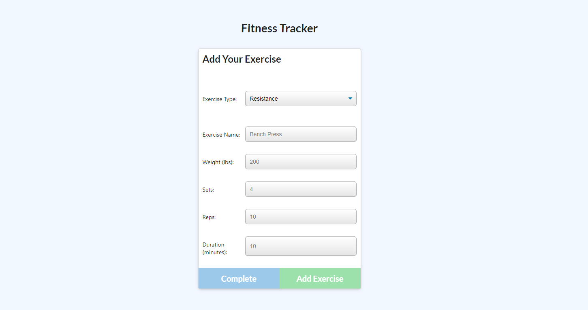
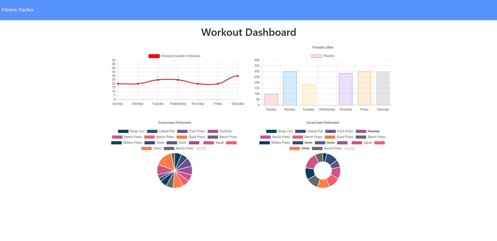

# Fitness_Tracker

## Description

A fitness tracker that allows users to log workout data for cardio and resistance training. User data is displayed on the dashboard, which catalogues the workouts for the previous seven days and categorizes them by workout type.

## Table of Contents

* [Usage](#usage)
* [Credits](#credits)
* [License](#license)

## Usage

[Click here for a live deployed version!](https://infinite-badlands-42147.herokuapp.com/)

**Below is a demonstration of the application's functionality:**

## Built With 

* Javascript
* Node.js
* Express
* MongoDB
* Mongoose

## Credits

* Robert Greenawalt (https://github.com/rsg71)

## Questions:
github.com/rsg71

## License

MIT License

Copyright (c) 2020 Robert Greenawalt

Permission is hereby granted, free of charge, to any person obtaining a copy of this software and associated documentation files (the "Software"), to deal in the Software without restriction, including without limitation the rights to use, copy, modify, merge, publish, distribute, sublicense, and/or sell copies of the Software, and to permit persons to whom the Software is furnished to do so, subject to the following conditions:

The above copyright notice and this permission notice shall be included in all copies or substantial portions of the Software.

THE SOFTWARE IS PROVIDED "AS IS", WITHOUT WARRANTY OF ANY KIND, EXPRESS OR IMPLIED, INCLUDING BUT NOT LIMITED TO THE WARRANTIES OF MERCHANTABILITY, FITNESS FOR A PARTICULAR PURPOSE AND NONINFRINGEMENT. IN NO EVENT SHALL THE AUTHORS OR COPYRIGHT HOLDERS BE LIABLE FOR ANY CLAIM, DAMAGES OR OTHER LIABILITY, WHETHER IN AN ACTION OF CONTRACT, TORT OR OTHERWISE, ARISING FROM, OUT OF OR IN CONNECTION WITH THE SOFTWARE OR THE USE OR OTHER DEALINGS IN THE SOFTWARE.